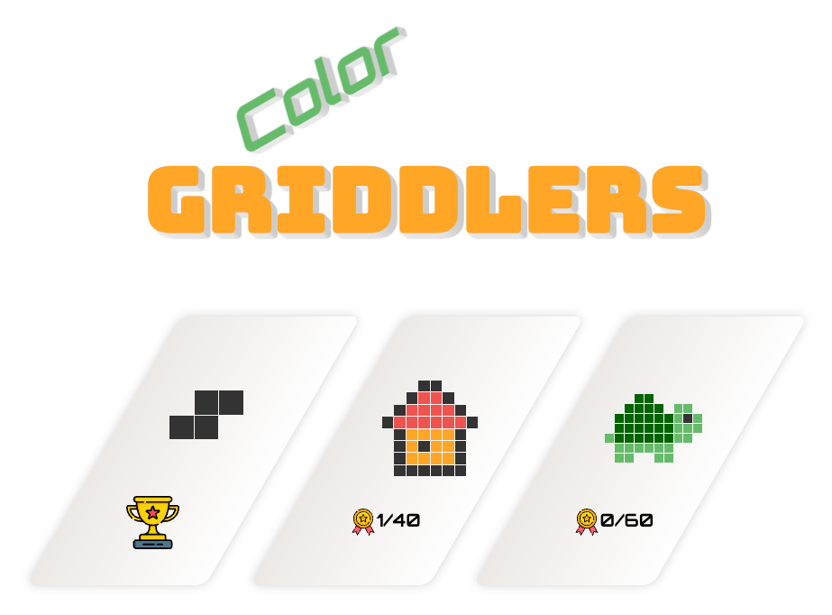
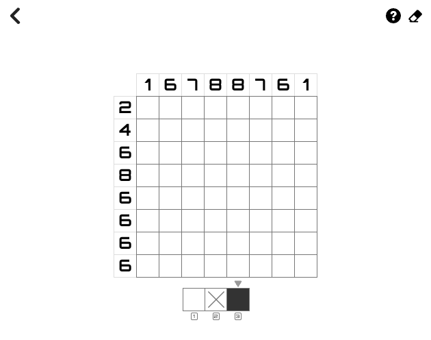
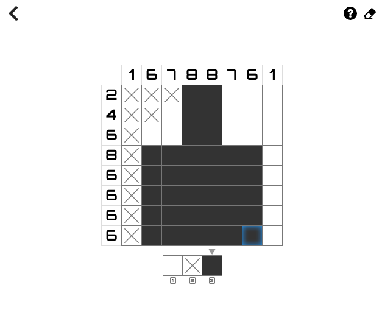
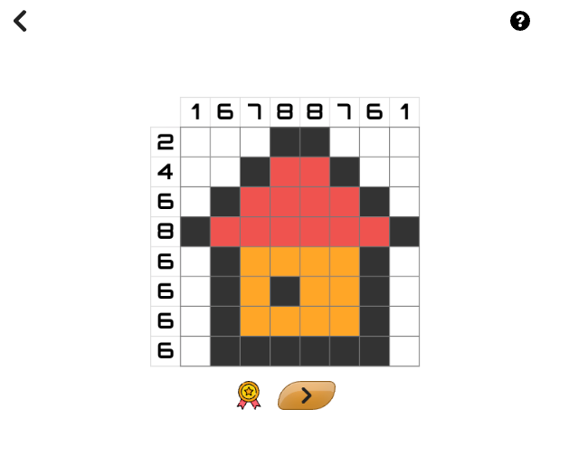

# Griddlers

Color Griddlers is a picture logic puzzle game in which cells in a grid must be colored or left blank
according to numbers at the side of the grid to reveal a hidden picture. It is based on popular Nonograms pen and
paper game. The game is also known as Paint by Numbers, Picross or Pic-a-Pix.



Is a client side web app only. It saves progress in local storage.

[Play it online](https://adi.earth/games/color-griddlers/#/)


## Dev

The game is developed in React with typescript.

To start it locally, you need to have node and yarn installed.

```
cd app
yarn install
yarn dev
```


## Build

To build the app in `app/dist` folder, run:

```
cd app
yarn build
```


## Play Example




